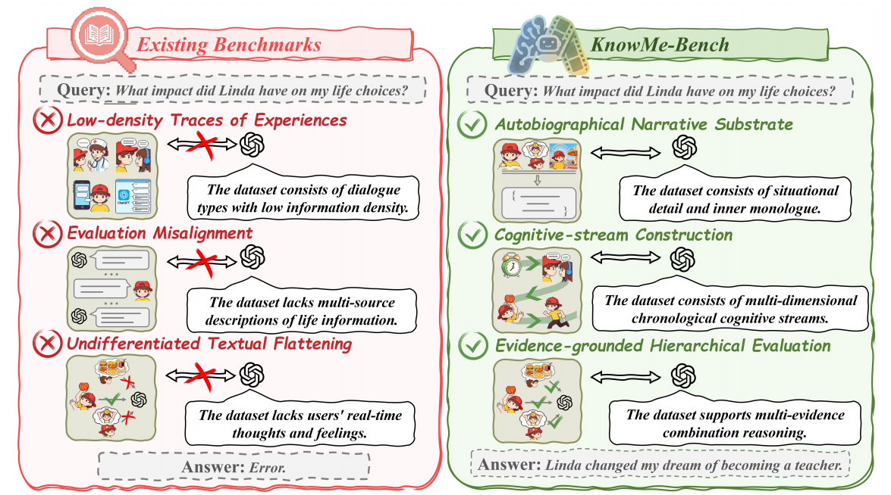
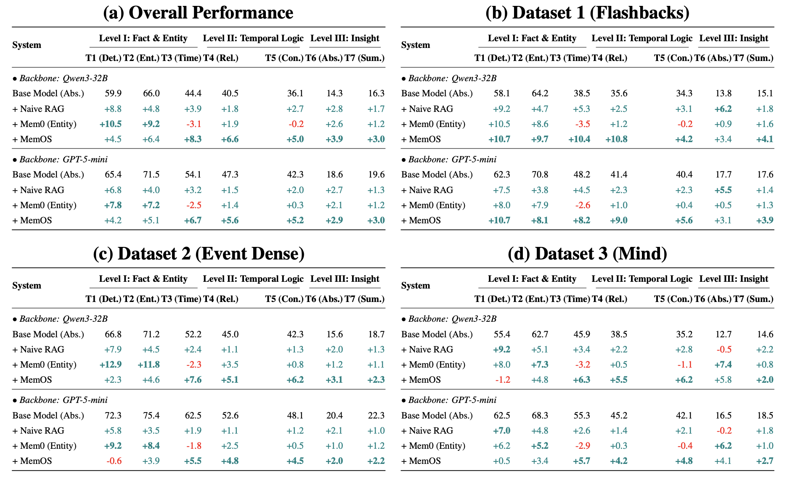
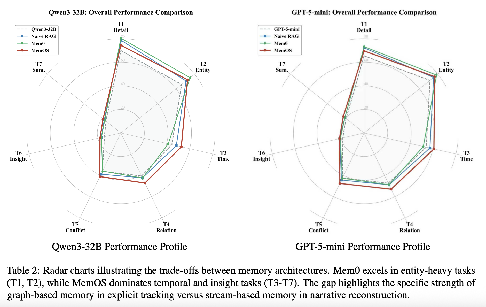

<div align="center">



# KnowMe-Bench: Benchmarking Person Understanding for Lifelong Digital Companions

<p style="margin: 20px 0;">
  <a href="https://arxiv.org/abs/2601.04745"></a>
<a href="https://huggingface.co/datasets/realty2333/knowMe-Bench"></a>
<a href="https://opensource.org/licenses/MIT"></a>
<a href="https://github.com/QuantaAlpha/KnowMeBench"></a>
</p>

</div>

---

**KnowMe-Bench** is a benchmark designed to evaluate **person understanding** in lifelong digital companions. Unlike existing benchmarks that rely on sparse dialogue logs, KnowMe-Bench is built from long-form autobiographical narratives (4.7M tokens), preserving the "micro-texture" of human experience—actions, inner thoughts, and environmental context.

This repository contains the dataset, the multi-agent generation pipeline, and the evaluation scripts described in our paper.

## 🌟 Key Features

* **Autobiographical Narrative Substrate**: Built from diverse literary sources (including Knausgård's *My Struggle*), retaining high-density internal monologues and situational details often lost in chat-based datasets.
* **Cognitive-Stream Construction**: Reconstructs narratives into time-anchored streams with 5 distinct fields: Visual, Auditory, Context, Background, and Inner Monologue.
* **Mnestic Realignment**: Specifically handles non-linear temporal structures (flashbacks) to prevent "Update Paradox" errors in memory systems.
* **Hierarchical Evaluation**: A 3-tier evaluation suite covering 7 tasks, from factual recall to psychoanalytic reasoning.

## 📂 Repository Structure

## 📊 Dataset Statistics

The benchmark consists of **2,580 evaluation queries** derived from **4.7M tokens** of source text.

| Dataset | Source | Characteristics | Key Challenge |
| --- | --- | --- | --- |
| **D1** | *My Struggle* | Flashback-Intensive | Handling non-linear time & mnestic triggers 
| **D2** | *Neapolitan Novels* | Event-Driven | Tracking linear causal chains & entity updates 
| **D3** | *In Search of Lost Time* | Psychological Depth | Interpreting abstract internal monologues 

## 🧠 Evaluation Tasks

KnowMe-Bench evaluates models across three cognitive levels:

### Level I: Precision & Factuality (The "Memory" Layer)
**T1: Context-Aware Extraction**: Entity recall under spatiotemporal constraints.

**T2: Adversarial Abstention**: Testing resistance to "Mismatching Trap" hallucinations.

**T3: Temporal Reasoning**: Duration calculation and timeline reconstruction.


### Level II: Narrative Logic & Causality (The "Reasoning" Layer)


**T4: Logical Event Ordering**: Ordering based on semantic dimensions (e.g., danger escalation).


**T5: Mnestic Trigger Analysis**: Identifying sensory cues that trigger memories.


### Level III: Psychoanalytic Depth (The "Insight" Layer)


**T6: Mind-Body Interaction**: Explaining ironic/contradictory behaviors.


  
**T7: Expert-Annotated Psychoanalysis**: Deep reasoning about motivations and identity.


## 🚀 Quick Start

### 1. Installation

```bash
git clone https://github.com/QuantaAlpha/KnowMeBench.git
cd KnowMeBench

```
Setup Environment Variables: As described in Section 4.4 of our paper, KnowMe-Bench utilizes an LLM-as-a-Judge protocol (defaulting to GPT-4o) to evaluate person understanding capabilities. You must export your OpenAI API key:

```bash
export OPENAI_API_KEY="sk-..."

```

### 2. Evaluation
We provide an automated evaluation script evaluate/run_eval.py that implements the three-tier evaluation suite (Level I, II, III). The script automatically selects the appropriate judging criteria based on the task type.

#### Step 1: Prepare Input Data
Prepare a JSON file (e.g., model_outputs.json) containing your model's generated answers merged with the reference ground truth. The format must include the task_type to trigger the correct scoring rubric:
```json
[
  {
    "id": 101,
    "task_type": "Adversarial Abstention",
    "question": "Did Elena meet fabrics in 1990?",
    "reference_answer": "The text does not mention this event.",
    "model_answer": "The text does not mention / I don't know."
  },
  {
    "id": 102,
    "task_type": "Logical Event Ordering",
    "question": "Order the events based on danger escalation...",
    "reference_answer": "1. Noise -> 2. Shadow -> 3. Attack",
    "model_answer": "1. Noise -> 2. Attack -> 3. Shadow"
  }
]
```

  > **Note:** The task_type must match the headers defined in evaluate/evaluate prompt.md (e.g., Logical Event Ordering, Mnestic Trigger Analysis, Expert-Annotated Psychoanalysis).

#### Step 2: Run the Judge
Run the evaluation script. This will use GPT-4o to score the responses on a 0-5 scale based on the specific rubric for each cognitive level (Precision, Logic, or Insight).
```bash
cd evaluate

# Run evaluation
python run_eval.py \
  --input_file model_outputs.json \
  --output_file results.json \
  --judge_model gpt-4o
```

#### Step 3: Analyze Results
The script generates a summary and a detailed JSON report (results.json) containing the score and reasoning for every query:
```json
{
  "meta": {
    "average_score": 4.8
  },
  "details": [
    {
      "id": 101,
      "score": 5,
      "reasoning": "Step 1: Check mechanism. The model correctly abstained from answering the hallucinated premise..."
    }
  ]
}
```

## 🏆 Baselines & Results

We evaluated several systems including Naive RAG, Mem0, and MemOS. Our findings show that while retrieval systems improve factual accuracy, they struggle with temporal logic and deep insight.

<div align="center">

</div>

<br/>

<div align="center">

</div>

See the paper for full results.

## 🛡️ Privacy & Ethics

All data in this benchmark has undergone a rigorous **Context-Aware De-identification Pipeline**. Key entities were mapped to pseudonyms (e.g., "Elena" → "Subject_A") and geolocation markers were coarsened to ensure privacy.

## 🖊️ Citation

If you use KnowMe-Bench in your research, please cite our paper:

```bibtex
@article{wu2026knowme,
  title={KnowMe-Bench: Benchmarking Person Understanding for Lifelong Digital Companions},
  author={Wu, Tingyu and Chen, Zhisheng and Weng, Ziyan and Wang, Shuhe and Li, Chenglong and Zhang, Shuo and Hu, Sen and Wu, Silin and Lan, Qizhen and Wang, Huacan and Chen, Ronghao},
  journal={arXiv preprint},
  year={2026}
}

```

## ✉️ Contact

For questions, please contact:

* Tingyu Wu: `wutingyu25s@ict.ac.cn`
* Zhisheng Chen: `chenzhisheng25@mails.ucas.ac.cn`
* Qizhen Lan: `Qizhen.Lan@uth.tmc.edu`
* Ronghao Chen: `chenronghao@alumni.pku.edu.cn`
* Huacan Wang: `wanghuacan17@mails.ucas.ac.cn`

```
